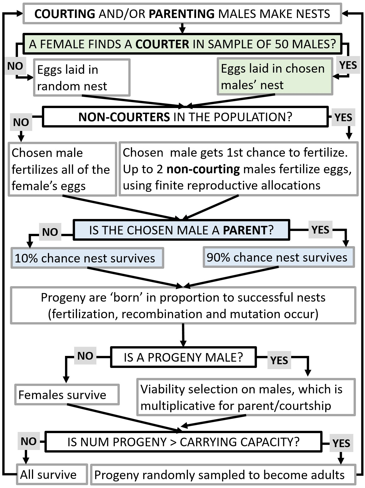

The purpose of this model is to understand how genetic architectures of alternative reproductive tactics impact their maintenance in populations. I'm using an individual-based simulation model with different selection scenarios, types of alternative tactics, and genetic architectures (genome-wide additive genetic variance, supergenes, expression networks).

```{r setup, include=FALSE}
knitr::opts_chunk$set(echo = FALSE,out.extra='',fig.pos="H",dpi=200,fig.height = 7,fig.width = 7)
knitr::opts_knit$set(root.dir='../results/') #change

```
```{r opts, echo = FALSE}
library(knitr)
knitr::opts_chunk$set(
  fig.path = "figs/"
)
```
```{r librarysetup, echo=FALSE,echo=FALSE,message=FALSE}
library(RColorBrewer)
library(scales)
library(sm)
library(kableExtra)
source("~/Dropbox (UC Enterprise)/Research/ARTs/R/002_freq_functions.R")
cols<-c(courter="#33a02c",parent="#1f78b4",cpref="#b2df8a",ppref="#a6cee3")
cols2<-c(CP='#d7191c',NCP='#fdae61',CNP='#abd9e9',NCNP='#2c7bb6')
```
```{r baseCols}
base_keep_cols<- c("Pop","PopSize","NumMal","NumFem","ParentThresh","ParentFreq","CourterThresh","CourterFreq","FreqNcNp","FreqCNp",
                   "FreqNcP","FreqCP","Courter2NonRS","Parent2NonSurvival")
poly_keep_cols<- c("Pop","PopSize","NumMal","NumFem","ParentThresh","ParentFreq","CourterThresh","CourterFreq","FreqNcNp","FreqCNp",
                    "FreqNcP","FreqCP","Polygyny")

```


## Overview of the model 

Males can be courters or not-courters and parents or not-parents. When the model is run with both traits, this results in four possible morphs: courter/parent, courter/not-parent, not-courter/parent, and not-courter/not-parent. Generations are non-overlapping and there is one reproductive bout per generation. In each generation, the population follows the following timeline: 



Each step is explained in further detail below. 

\newpage

### 1. Choosing a nest

A female samples 50 males and chooses a male to nest with based on his courtship trait. If there are no courtship traits in the model, she chooses based on the male's parental trait. If she does not encouter an acceptable male, she nests with a randomly chosen male. If she encounters multiple equally-acceptable males, she randomly selects one of them.  

### 2. Fertilization

Once a female decides to nest, up to three males can fertilize the nest. Courters and parental males can contribute more sperm than non-courter and non-parental males: $r_{courter}=8$ and $r_{non-courter}=4$. The male with whom the female is nesting gets $r_{courter}/\Sigma{n_{sperm}}$ and additional non-courting males (up to 2) get $(r_{non-courter}*0.5/\Sigma{n_{sperm}})$, where $\Sigma{n_{sperm}}$ is the total number of sperm contributed by all of the males, weighted by the sperm competition factor (0.5 is the default for all males except the chosen male). So, when a female mates with one courter and two non-courters, $\Sigma{n_{sperm}}$ = $r_{courter}$ + 2$*$(0.5$*$$r_{non-courter}$), where $r_{courter}$ = 8 and $r_{non-courter}$ = 4, therefore $\Sigma{n_{sperm}}$ = `r sum(8,rep((0.5*4),2))`. 

That being said, every time a male mates he uses his sperm, so after one mating where a courter fertilizes 50% of the female's 4 eggs, he only has 6 sperm for his next mating. 

In these runs, males who are courters cannot sneak fertilizations.

### 3. Nest Survival

Before the offspring can survive, the nest has to survive. This step is only relevant when parental traits are in the model - if only the courtship trait is specified, then all progeny in the nest survive at this point. When males have the parental trait, if the female has given eggs to a non-parental male (because she chose based on courtship traits), then the nest has a 0% chance of surviving. If the female has given eggs to a parental male, the nest has a 100% chance of surviving. [this is changed from defaults - it was 10% and 90%]

### 4. Density-dependent survival

Once the identities of the surviving nests are known--along with the identities of the parents, including sneaker parents--the offspring are created in the simulation. The offspring are created to fill the full carrying capacity of the population, with the numbers per nest being equally divided among all surviving offspring. This allows the population to maintain a constant population size (prior to viability selection) while maintaining the relative successes of the given genotypes/morphs. 

### 5. Viability selection 

Before becoming adults, the offspring experience viability selection. Courters and parental males are disfavored in viability selection, with a survival probability of `r exp(-0.5/(2*50))`. If an individual is both a courter and a parental male, the survival probability is `r exp(-0.5/(2*50))*exp(-0.5/(2*50))`. Non-courters and non-parental males have survival probabilities of 1. 

### Evaluating equilibrium

After 10000 generations, I begin tracking the change in frequency of the courter and parent traits, and do so for 2000 additional generations. I calculate the variance in the change in frequency over those 2000 generations. I declare an equilibrium ('stasis') has been reached if the last change in frequency of both traits is less than the variance in changes in frequency. 

### Replicates

I ran five independent instances of the model, each of which had four replicates spawned from identical starting conditions. This approach was chosen to reduce the effects of stochasticity in this type of model. In the multi-panel figures below, each row contains the four replicates that originated with identical starting conditions. 

## Single locus models

I ran some simple sets of parameters where I have an expectation for the outcome. In these models, both the courter and parent traits existed and there was a single QTL that was not anchored to a physical chromosomal location and experienced no recombination. I also assumed that nests laid with non-parents have 0% chance of survival and those with parents have 100% chance of survival. In all of these cases, only non-courting males fertilized a nest that did not belong to them.

### Expectation: courter-parents will dominate

The first of these scenarios arise when courters and parents have a reproductive advantage (they can fertilize 8 eggs compared to the non-courter and non-parent's 4 eggs). The nesting male (regardless of phenotype) experienced a reproductive advantage by fertilizing a higher proportion of the eggs. 

```{r courterRS, fig.cap="Stacked bar charts showing the frequencies of the four morph types in the final generation of each replicate. Five rounds of the model were run, each with 4 replicates that all started with the same initial conditions, and the numbers on the x-axis refer to which indepedent round these results are from.", fig.height=3,fig.width=6.5}
courterRS<-get.morph.freqs(plot.pc.reps(pattern="pcu_1locus_nestBinary_courterRSadvantage.*summary.txt",path="single_locus",cols,make.plot=FALSE))
courterRS$Courter2NonRS<-8/4
bp<-barplot(t(as.matrix(courterRS[,c("FreqNcNp", "FreqCNp", "FreqNcP", "FreqCP")])),
        col=cols2[c("NCNP","CNP","NCP","CP")],
        names.arg = gsub("^.*(\\d)_summary.txt.*$","\\1",rownames(courterRS)),
        las=2,
        border=NA)

par(fig=c(0, 1, 0, 1), oma=c(0, 0, 0, 0), mar=c(0, 0, 0, 0), new=TRUE)
plot(0,0, type='n', bty='n', xaxt='n', yaxt='n')
legend("top",bty='n',legend = c("Courter/Parent","Courter/Non-parent","Non-courter/Parent","Non-courter/Non-parent"),
       col=cols2[c("CP","CNP","NCP","NCNP")],pch=15,xpd = TRUE,ncol=2,cex=1.25)

```


With the current set of conditions, when males are only permitted to mate once, some variation is able to be maintained in the population (Fig. \@ref(fig:courterRS)), even though the Parent/Courter morph has higher fitness at each step of the model. However, it does follow our prediction that only parents will be able to be maintained in the population. The final outcome of the population appears to be somewhat dependent on the initial frequencies of the parent and courter traits (Fig. \@ref(fig:courterRSinitialvfinal)).


```{r polyCourterRS, fig.cap="Stacked bar charts showing the frequencies of the four morph types in the final generation of each replicate. Five rounds of the model were run, each with 4 replicates that all started with the same initial conditions, and the numbers on the x-axis refer to which indepedent round these results are from.", fig.height=3,fig.width=6.5}
courterRSpoly<-get.morph.freqs(plot.pc.reps(pattern="pcu_1locus_polygyny_nestBinary_courterRSadvantage.*summary.txt",path="single_locus",cols,make.plot=FALSE))
courterRSpoly$Courter2NonRS<-8/4
bp<-barplot(t(as.matrix(courterRSpoly[,c("FreqNcNp", "FreqCNp", "FreqNcP", "FreqCP")])),
        col=cols2[c("NCNP","CNP","NCP","CP")],
        names.arg =gsub("^.*(\\d)_summary.txt.*$","\\1",rownames(courterRS)),
        las=2,
        border=NA)

par(fig=c(0, 1, 0, 1), oma=c(0, 0, 0, 0), mar=c(0, 0, 0, 0), new=TRUE)
plot(0,0, type='n', bty='n', xaxt='n', yaxt='n')
legend("top",bty='n',legend = c("Courter/Parent","Courter/Non-parent","Non-courter/Parent","Non-courter/Non-parent"),
       col=cols2[c("CP","CNP","NCP","NCNP")],pch=15,xpd = TRUE,ncol=2,cex=1.25)

```


### Expectation: multiple morphs will be maintained

I ran a set of models with the following parameter variations, in which I expected multiple morphs to be maintained.

```{r}
expTab<-data.frame(Name=c("courterRSadvantage", "equalFitness","onlySpermComp","sneakRSadvantage","sneakRSadvantage_courterRSadvantage"),
                   ParentRS=c(8,4,4,4,4),
                   NonParentRS=c(4,4,4,8,8),
                   CourterRS=c(8,4,4,4,8),
                   NonCourterRS=c(4,4,4,4,4),
                   SpermCompFactor=c(0.5,1,0.5,0.5,0.5))
kable(expTab,booktabs=TRUE,"latex",
      caption = "The different parameter settings used for the models where multiple morphs are expected, because fitnesses should equal out between morphs.") %>%
  kable_styling(latex_options=c("scale_down","HOLD_position"))
```


```{r multipleMorphs,fig.cap="Stacked bar charts showing the frequencies of the four morph types in the final generation of each replicate. Five rounds of the model were run, each with 4 replicates that all started with the same initial conditions, and the numbers on the x-axis refer to which indepedent round these results are from. The top row are runs where males can only mate once and the bottom row are runs where males can mate with multiple females. The top row is for the case when males mate with one female, and the bottom is polygyny.", fig.height=6,fig.width=7.5}
var_patts<-c("pcu_1locus_nestBinary_equalFitness.*summary.txt",
             "pcu_1locus_nestBinary_onlySpermComp.*summary.txt",
             "pcu_1locus_nestBinary_sneakRSadvantage_\\d.*summary.txt",
             "pcu_1locus_nestBinary_sneakRSadvantage_courterRSadvantage.*summary.txt",
             "pcu_1locus_polygyny_nestBinary_equalFitness.*summary.txt",
             "pcu_1locus_polygyny_nestBinary_onlySpermComp.*summary.txt",
             "pcu_1locus_polygyny_nestBinary_sneakRSadvantage_\\d.*summary.txt",
             "pcu_1locus_polygyny_nestBinary_sneakRSadvantage_courterRSadvantage.*summary.txt")

par(mfrow=c(2,length(var_patts)/2),oma=c(3,2,4,1),mar=c(3,2,4,1),xpd=TRUE)
varDat<-lapply(var_patts,function(pattern){
  dat<-get.morph.freqs(plot.pc.reps(pattern=pattern,path="single_locus",cols,make.plot=FALSE))
  bp<-barplot(t(as.matrix(dat[,c("FreqNcNp", "FreqCNp", "FreqNcP", "FreqCP")])),
        col=cols2[c("NCNP","CNP","NCP","CP")],
        names.arg =gsub("^.*(\\d)_summary.txt.*$","\\1",rownames(courterRS)),
        las=2,
        border=NA,
        main=gsub("^.*nestBinary_(\\w+)[[:punct:]].*","\\1",pattern))

  return(dat)
})
par(fig=c(0, 1, 0, 1), oma=c(0, 0, 0, 0), mar=c(0, 0, 0, 0), new=TRUE)
plot(0,0, type='n', bty='n', xaxt='n', yaxt='n')
legend("top",bty='n',legend = c("Courter/Parent","Courter/Non-parent","Non-courter/Parent","Non-courter/Non-parent"),
       col=cols2[c("CP","CNP","NCP","NCNP")],pch=15,xpd = TRUE,ncol=2,cex=1.25)

```

