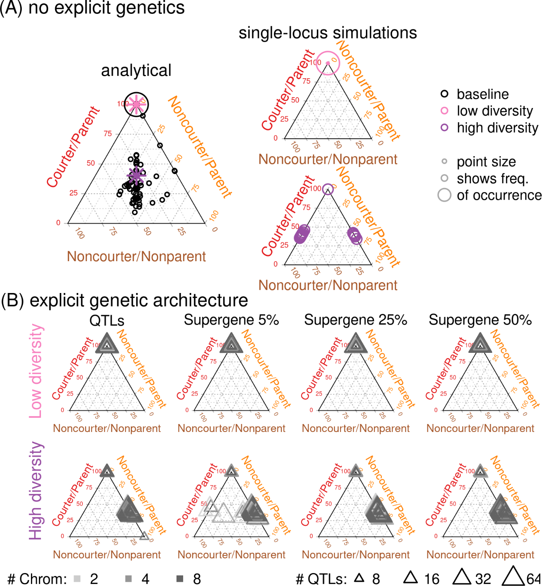

```{r, include=FALSE}
remove_author <- function(x) {
  # identify empty author line
  i <- grep("^\\\\author\\{\\}$", x)
  # be sure it is the one pandoc inserts
  if(length(i) != 0 && grepl('^\\\\date\\{', x[i+1])) x <- x[-i]
  x
}
options(bookdown.post.latex = remove_author)
```

```{r setup, include=FALSE, warning=FALSE}
knitr::opts_chunk$set(echo = FALSE,out.extra='',fig.pos="H",dpi=200,fig.height = 7,fig.width = 7)
knitr::opts_knit$set(root.dir='../results/') #change

```

```{r opts, echo = FALSE, warning=FALSE}
library(knitr)
knitr::opts_chunk$set(
  fig.path = "../figs/"
)
options(kableExtra.auto_format = FALSE)
```

```{r librarysetup, echo=FALSE,echo=FALSE,message=FALSE, warning=FALSE}
library(RColorBrewer)
library(scales)
library(sm)
library(kableExtra)
library(plotly)
library(dplyr)
library(vegan)
library(tidyr)
tmp<-sapply(list.files(path="../../spfTools/R/",full.names = TRUE),source)
source("../R/002_freq_functions.R")

source("../morph_predictions/check_freqs.R")
source("../morph_predictions/morph_gens_ns.R")

source("../R/formatting.R")
```

# Introduction

A wide variety of animals exhibit sex-specific morphs that are generally
associated with different discrete ways of maximizing reproductive
success, which are often referred to as alternative reproductive tactics
[@oliveiraAlternativeReproductiveTactics2008]. These stable
polymorphisms are typically maintained in populations through negative
frequency-dependent selection (e.g., female morphs in damselflies
[@iserbytNegativeFrequencydependentSelection2013]; Gouldian finches
[@prykeFrequencydependentPhysiologicalTradeoffs2007]), the interaction
of frequency-dependent and density-dependent factors (e.g.,
side-blotched lizards [@alonzoMateChoiceGames2001]), and fluctuating
selection pressures enabling the partitioning of reproductive success
over time (e.g., the feminized dwarf spider morph mates earlier, whereas
the alternative morph is able to mate with previously-mated females
later in the season [@hendrickxMasculinizingSupergeneUnderlies2022]).
When these tactics are fixed within an individual throughout its
lifetime, an individual's tactic is likely to have a large genetic component (e.g.,
dwarf spiders, side-blotched lizards, ruffs; examples reviewed in
[@oliveiraAlternativeReproductiveTactics2008;
@mankSexspecificMorphsGenetics2022]), and have been modelled using
explicitly or implicitly simple genetic architectures of one or two
genetic loci [@sinervoRunawaySocialGames2001;
@sinervoRockPaperScissors1996;
@takahashiNegativeFrequencydependentSelection2010;
@svenssonFemalePolymorphismFrequency2005;
@sinervoDevelopmentalPhysiologicalNeural2006;
@alonzoMateChoiceGames2001; @ryanGeneticPolymorphismSwordtail1992;
@morrisIntralocusTacticalConflict2013]. Given that morphs are suites of
traits inherited together, some authors have explored in verbal models
the importance of correlational selection and its associated formation
of genetic correlations and linkage disequilibrium across loci
[@sinervoCorrelationalSelectionEvolution2002]. While these relatively
simple genetic models do capture the evolutionary dynamics of the
specific examples they are paired with [@sinervoRunawaySocialGames2001;
@tsubakiGeneticPolymorphismLinked2003a], genomic data has accumulated
for a number of species suggesting that categorical traits might in fact
be underpinned by numerous quantitative genetic loci
[@kimGeneticsEvidenceBalancing2019;
@slyMolecularParallelismSignaling2022].

Consistent with other work suggesting that traits critical to
reproductive fitness are determined by the additive contributions of
many loci throughout the genome [@slyMolecularParallelismSignaling2022;
@flanaganGenomewideSelectionComponents2017], several alternative
reproductive tactics are associated with many genetic variants
throughout the genome which contribute primarily additively to the
phenotypes [@kimGeneticsEvidenceBalancing2019] -- implying that although
the tactics might be discrete and inherited in an apparently Mendelian
fashion, their genetic basis is much more complex and multivariate. A
particularly intriguing result is that structural variants have
aggregated multiple variants contributing to the tactics into a
'supergene' in at least three species with alternative reproductive
tactics: the ruff [@lamichhaneyStructuralGenomicChanges2016;
@kupperSupergeneDeterminesHighly2016], white-throated sparrow
[@thomasChromosomalPolymorphismLinked2008], and dwarf spiders
[@hendrickxMasculinizingSupergeneUnderlies2022]. Supergenes have also
been linked to sex-specific traits important to reproduction such as
sperm morphology [@kimSexlinkedSupergeneControls2017;
@kniefSexchromosomeInversionCauses2017], head colour
[@gazdaGeneticMechanismSexual2020], and sex-specific migratory
behaviours [@pearseSexdependentDominanceMaintains2019]. The potential
for supergenes to underpin sexually dimorphic polyphenisms is
intriguing, as it could explain the apparent mis-match between simple
single-locus population genetic models and the fact that these
reproductive tactics are suites of complex traits
[@sinervoRunawaySocialGames2001]. Supergenes, with their reduced
recombination between variants, also provide a mechanism for individuals
with largely similar genomic information to harbour fixed genetic
variation without requiring differential gene expression. Examples where
supergenes apparently underpin sexually dimorphic phenotypes tend to
involve multiple morphs of one sex, usually males. All known examples of
alternative morphs determined by supergenes include a female-mimic
morph, including ruffs [@kupperSupergeneDeterminesHighly2016;
@lamichhaneyStructuralGenomicChanges2016], dwarf spiders
[@hendrickxMasculinizingSupergeneUnderlies2022], and white-throated
sparrows [@thomasChromosomalPolymorphismLinked2008]. In the ruffs, a
third male morph exists, with an intermediate phenotype between the
dominant or 'classic' male morph and the female-mimic
[@kupperSupergeneDeterminesHighly2016;
@lamichhaneyStructuralGenomicChanges2016]. In some cases, a heterozygous
genotype is lethal (e.g., ruffs [@kupperSupergeneDeterminesHighly2016;
@lamichhaneyStructuralGenomicChanges2016]), but not in others (e.g.,
dwarf spiders [@hendrickxMasculinizingSupergeneUnderlies2022]). In the
white-throated sparrow and the ruff, these structural variants are
successful in coding for these variable phenotypes because they include
androgen receptors [@maneySupergenesSteroids2022]-- the white-throated
sparrow supergene contains the estrogen receptor gene which directly
influences the aggressive aspects of the dominant male phenotype
[@merrittSupergenelinkedEstrogenReceptor2020].

An open question is: to what extent do supergenes facilitate the
maintenance of multiple morphs, versus whether the evolution of multiple
morphs might facilitate the evolution of supergenes? This question is
difficult to address empirically, and is likely to have consequences for
the maintenance of genetic variation at loci contributing to traits. For
example, if a supergene exists and a mutation or arises within it that
impacts the morph traits, the genetic variation within the supergene
itself could have eroded due to relaxation of selection and reduced
recombination. As such, only the mutation would be likely to show
significant genetic variation -- this could make a supergene with
functional effects difficult to detect empirically. This is especially
true in cases such as the white-throated sparrow, in which the gene with
a major effect is an estrogen receptor
[@merrittSupergenelinkedEstrogenReceptor2020], which likely impacts the
expression of many genes. Furthermore, it is currently unknown to what
extent genetic architectures -- and the constraints inherit to them --
impact the dynamics of the frequency- and density-dependent mechanisms
that maintain simple cases of genetic variation in populations.

An additional challenge arises from limitations in the empirical data
that can be used to identify genetic architectures of these traits and
uncover the mechanisms governing their evolution. The majority of
examples involved researchers first generating a high quality reference
genome and subsequently performing whole genome resequencing of
individuals of each morph and sex to identify variants within
populations that are associated with the phenotypic tactics
[@lamichhaneyStructuralGenomicChanges2016; @maneySupergeneBirdFour2020;
@kupperSupergeneDeterminesHighly2016;
@merrittSupergenelinkedEstrogenReceptor2020;
@kimSexlinkedSupergeneControls2017; @kimGeneticsEvidenceBalancing2019;
@thomasChromosomalPolymorphismLinked2008;
@hendrickxMasculinizingSupergeneUnderlies2022]. Alternative approaches
involve linkage mapping [@lepaisGeneticArchitectureThreshold2017] or the
investigation of differential gene expression between morphs
[@nugentNeuroendocrineProfilesAssociated2016;
@stuglikAlternativeReproductiveTactics2014;
@takahashiCandidateGenesAssociated2019]. These methods have proven
successful in some cases, although for many other types of traits the
ability to detect causal variants is generally limited
[@josephsWhatCanGenomewide2017;
@uricchioEvolutionaryPerspectivesPolygenic2020;
@stringerUnderestimatedEffectSizes2011]. Regardless, despite the
potential ability to uncover the most important evolutionary processes
in the evolution of these traits using genomic data
[@bitarelloInferringBalancingSelection2023;
@svenssonCorrelationalSelectionAge2021;
@weigandDetectingSignaturesPositive2018], the power might be
substantially limited in real-world samples
[@kellyPromiseDeceitGenomic2021;
@flanaganIdentifyingSignaturesSexual2015]. In part, this limitation is
due to lacking a predictive understanding of how different genetic
architectures can influence evolutionary dynamics of polygenic traits.

To tackle these problems, we use models to test how different genetic
architectures impact the maintenance of multiple male reproductive
morphs. We focus on first identifying key reproductive parameters that
influence the maintenance or loss of morphs using an analytical haploid model.
Then, we test whether different types of diploid genetic
architectures (single locus, polygenic, and polygenic supergene) change
the frequencies of morphs that are maintained using a simulation model.
We also test the accuracy and ability of current empirical methods in
identifying true causal genetic variants using the simulated genotypes
from our model.

# Methods

Our model considers a biological scenario in which males can display to
attract females and can provide obligate male parental care. In our model,
males possess two independent traits, courtship and parental care, both
of which are expressed only in males. We assume that all females in the population always
prefer males with the courting trait, but females do not know when
choosing whether males will be parents. Males who do not court can only
reproduce by sneaking, and males who display but do not provide any
parental care will not produce viable offspring. Thus, our model has
four morphs: courter/parents (CP); courter/non-parents (CN);
non-courters/parents (NP); or non-courters/non-parents (NN). 
Our model assumes non-overlapping generations and no environmental effects on traits. While this model does
not directly apply to all examples of alternative reproductive tactics,
it is biologically reasonable and common even if not universally true.
We expect that this model can be generalized to species in which one sex
(but not the other) has two fixed traits that impact mating success and
the survival of their offspring.

To test the importance of genetic architecture in male morphs, we implemented three models. 
First, we developed an analytical model that reflects haploid inheritance of a single locus that encodes morphs. This model did not include recombination or mutation.
Second, we used a stochastic individual-based model with two diploid loci, one for each trait (courting and parenting), that incorporated recombination, mutation, and demographic stochasticity.
Finally, we expanded the stochastic model to incorporate polygenic inheritance of the two traits, with two different explicit physical genetic architectures: quantitative trait loci (QTLs) distributed at random throughout a genome including non-coding loci and a supergene architecture, where QTLs were co-located in a non-recombining region of a single chromosome. We assumed all QTLs were autosomal. 
Each allele at a QTL was assigned a
randomly-drawn phenotypic effect, and an individual's quantitative
phenotypic value was determined by the sum of all their allelic effects
(i.e., traits were entirely additive).
In these additive, polygenic models, male traits were determined by a
threshold function. The value of the threshold was constant for each
iteration of the model, and was initialized as the mean phenotypic value
at generation 0, prior to any model iterations. 
In all cases of the individual-based models,
Sex was assigned instead by a draw from a binomial distribution with a
probability of 0.5 of being female.

In all three models, each generation has five distinct phases: (1) mate choice; (2)
fertilization; (3) parental care; (4) viability selection; and (5)
maturation to adulthood (Fig. \@ref(fig:modelDiagram)). We will describe each of these phases and highlight differences between the models when appropriate. 

```{r modelDiagram, fig.cap="Diagram of the biological life cycle modelled in both the analytical model and the simulation model. The model has five phases, starting with (1) Adults interact to find mates. Differences between the models are articulated in the diagram.", out.width='100%'}
knitr::include_graphics("../figs/lifecycle_biology.png", dpi=150)
```


## Stage 1: Mate choice


In the mate choice phase of the model, we assumed females always preferred to mate with
males displaying the courtship trait and did not mate with non-courting males. 
If a female decided to mate with a
male, he received all of her eggs to care for. 

In the analytical model, this mate choice phase determined to total number of 
clutches in the population, $n$. 
The general calculation for the number of clutches is:

$$
n=w_s(N_m f_{CP} + N_m f_{CN}) + (1-w_s)(N_m f_{NP} + N_m f_{NN}), 
$$

where $w_s$ specified the probability a female chose a courting male (CP or CN),
$N_m$ was the number of males in the population, the $f$ terms
represented the frequency of each morph. To match our model assumptions, $w_s=1$, so $n$
simplified to $w_s(N_m f_{CP} + N_m f_{CN})$.

The simulation model incorporated stochasticity at this stage of the model. 
Females searched through a set number of males and chose the
first attractive male (i.e., the first courting male she encountered).
If a female did not find an acceptable mate, she did not mate 
(see Fig. S2 for less strict mating dynamics).

## Stage 2: Fertilization

A chosen male was not guaranteed paternity of an entire brood, 
because non-courting males were able to fertilize a proportion of the eggs.
The chosen parent had first-male fertilization advantage. 
The consequence of this scenario is that the only mechanism
by which non-courters can produce offspring is through sneak
fertilizations. 
Specifically, we modelled sneaking by specifying a total number of sneakers, $n_{sneak}$,
that could fertilise via sneaking in each clutch, and each sneaker could contribute up to their individual reproductive
allocation (where $r_{NN} = r_{NP}$) offset by the sperm competition
coefficient ($c$).
We explored the impact of different values of these parameters in the analytical model, but for all simulation models analysed here, $n_{sneak}=3$ and $c=0.5$. 
We also assumed inherent 'reproductive allocations',$r_M$ (where $M$
designated the morph and contained $\{CP, CN, NP, NN\}$), for each morph,
which sets a ceiling  on the number of offspring any male can sire.  
 

In the analytical model, we modelled the fertilisation success for morphs by considering their success in their own clutch, $e_{o_M} = f_M N_m r_M w_{s_M}$ (which will only be non-zero for courting morphs).
We specified the maximum
number of possible fertilizations arising from sneaking for a given
non-courting morph was $N_s = n c n_{sneakers} r_{NN}$.
If the number of fertilizations arising from sneaking was smaller than the
morph's potential population-level reproductive effort (i.e, if
$N_s < f_M N_m r_M$), the number of eggs fertilized through sneaking for
that morph was the difference between $N_s$ and $f_M N_m r_M$, truncated
at zero. Otherwise, the number of eggs fertilized through sneaking was
$f_M N_m r_M$.

In the simulation model, we incorporated recombination and mutation during the fertilisation process. 
Recombination occurred
independently on chromosomes inherited from the mother and the
chromosome inherited from the father. The number of recombination events
for a given chromosome was determined by drawing from a Poisson
distribution with the recombination rate as the mean, which we set to
0.2. For each recombination event, breakpoints were chosen by randomly
drawing from the total number of markers on a chromosome. These
breakpoints defined the segments of the chromosome that experienced
recombination, and each segment was randomly chosen to be assigned the
genotypes and effects from the parents' maternal or paternal chromosome.
When the genetic architecture was that of a supergene, if the
breakpoints fell within the region containing the aggregated QTLs for
the traits, the offspring was considered not viable, mimicking
suppressed recombination as observed in empirical examples (e.g., ruffs
[@lamichhaneyStructuralGenomicChanges2016;
@kupperSupergeneDeterminesHighly2016]).

After recombination, mutation occurred at a rate of $\mu$ at each locus. For
a given individual, the number of mutations introduced was determined as
$2\mu n_{SNPs} n_{chrom}$, where $n_{SNPs}$ was the number of SNPs and
$n_{chrom}$ was the number of chromosomes in the simulation. The
location of each mutation was randomly selected and the allele at that
location was randomly chosen from the set of existing alleles. The
mutation also impacted the phenotypic effects of QTLs by altering the
original effect by a value drawn from a normal distribution with a mean
of 0 and a standard deviation of $\sigma_\mu$. Finally, offspring were
also randomly assigned a sex.


## Stage 3: Parental care

We assumed for
simplicity that males with the parental care trait have 100% offspring
survival while males without the parental care trait have 0% survival,
independent of the male's courtship trait. 
In the simulation model, this was straightforward to model: 
after the males were assigned their
paternity shares (during fertilisation), the clutch survived if the chosen male was also a
parent. Because of this assumption, and those in Stage 1,
the courter/non-parent morph never produced viable offspring.

In the baseline model, we modelled this by defining the selection coefficient for clutch
survival, $w_{n_M}$, which determined the success of each morph's clutch, assuming the morph was chosen by a female: $o_{o_M} = e_{o_M} w_{n_M}$. 
To match our model assumptions,  $w_{n_CP} = w_{NP} = 1$ and
$w_{n_CN} = w_{NN} = 0$. 
We also calculated the number of surviving offspring from
sneaking as:

$$
o_{s_M} = e_{s_M} \frac{\Sigma{o_{o_M}}}{\Sigma{e_{o_M}}}.
$$

Because we assumed entirely obligate parental care, the fraction was
either 1 or 0, depending on whether the morph holding the clutch had the
parental care trait. Each morph's total number of offspring produced ($o_M$) was
the sum of $o_{o_M}$ and $o_{s_M}$. 


## Stage 4: Viability selection

We assumed viability selection only affects male offspring, as a trade-off for courting and parental care.
In the baseline model, we multiplied the viability selection coefficient (${w_v}_M$) by the
surviving number of offspring per morph ($o_M$), to determine the number of surviving juveniles per morph: $j_M = o_M w_{v_M}$. In the simulation model, we calculated a survival probability for each male offspring, as $e^{\frac{-(morph - \theta)(morph - \theta)}{2\omega_v}}$, where $\omega_v$ was the strength of viability selection, $morph$ equalled 1 for courters and parents and 0 for non-courters and non-parents, and $\theta = 0$. 
For each individual, a random value between 0 and 1 was drawn from a uniform distribution; if the number was larger
than his survival probability, that individual did not
survive to adulthood. 
In both models, viability selection acted multiplicatively on courter/parents.

## Stage 5: Maturation to adulthood

In the baseline model, the final stage in the life cycle was calculating the frequency of each morph
in the next generation by dividing the surviving number of juveniles per morph after viability selection
($j_M$) by the sum of all surviving juveniles:
$f_M = \frac{j_M}{\Sigma_{i=1}^4{j_i}}$.

In the simulation model, the total number of surviving offspring in the
population depended on the proportion of population reproductive success
achieved by each individual male and female (i.e., each generation, the
number of offspring created was equal to the carrying capacity).
If the number of surviving
offspring was larger than the carrying capacity, offspring were randomly
selected to become adults. 


## Evaluating model outcomes

### Baseline analytical model

To evaluate the outcomes of this analytical model, we iterated forward
in time for 100 generations from 1659 combinations of initial morph
frequencies and repeated those iterations across 5 values for the sperm
competition coefficient ($c$ = {0..1}), 21 values for the relative
reproductive coefficient ($r_M$ = {0...2}), and 3 values of the number
of sneakers ($n_{sneakers}$ ={1..3}). The iterations were implemented in
R v. 4.1.1 [@rcoreteamLanguageEnvironmentStatistical2021] using some
features of tidyR [@wickhamTidyrTidyMessy2021]. We also ran a subset of
parameter combinations for 1,000 generations for better comparisons with
the simulation model.

We were interested in identifying the regions of parameter space that
resulted in the largest diversity of male morphs. We leveraged
existing ecological mathematical tools to summarize diversity of a
system into a single metric -- specifically, Shannon's
diversity index. We calculated this index in the 100th generation using
the R package vegan [@oksanenVeganCommunityEcology2015] and subsequently
visualised the diversity of the population using contour plots produced
by plotly [@sievertInteractiveWebbasedData2020] in a shiny app that
relies on R packages shiny [@changShinyWebApplication2021],
shinydashboard [@changShinydashboardCreateDashboards2018], rsconnect
[@mcphersonRsconnectDeploymentInterface2021], dplyr
[@wickhamDplyrGrammarData2021], and rmarkdown
[@allaireRmarkdownDynamicDocuments2021; @xieMarkdownDefinitiveGuide2018;
@xieMarkdownCookbook2020]. The interactive app is available at
<https://spflanagan.shinyapps.io/morph_predictions/> (see Fig. S1 for a static image).

This model provided a baseline predictions for
parameter values likely to facilitate morph diversity within a
population.

### Individual-based simulation model 


We initialized four replicate populations with
identical starting conditions to evaluate the effect of
stochasticity on the simulation models. These identical conditions included
randomly-generated values for the allelic effects of QTLs, the exact
number of individuals of each sex and morph, and the thresholds for
determining morph traits (i.e., the values at which an individual is
deemed a courter vs a non-courter and a parent vs a non-parent). For
each set of four populations, we ran 10,000 generations followed by
2,000 'experimental' generations. Doing so ensured that the population
reached a steady state in which we could examine any stable


To explore the impacts of genetic architecture on morph maintenance, we
used two sets of demographic and reproductive parameters that were
identified by the baseline model as either facilitating high or low
morph diversity. Within each of these parameter settings, we compared
model outcomes with for cases with each combination of 2, 4, or 8
chromosomes and 8, 16, 32, or 68 QTLs underlying each trait. We also
tested three supergene sizes: occupying 5% of a chromosome, 25% of a
chromosome, or 50% of a chromosome. In all cases, a chromosome was
comprised of 1000 loci (including marker loci and QTLs).

#### Analysing multilocus genotypes

To provide a link between the predictions of our theoretical models and
empirical data, we analysed the genetic diversity of the populations at
the final generation of the individual based simulations. This is an
equivalent analysis to the re-sequencing conducted in empirical studies
[@lamichhaneyStructuralGenomicChanges2016; @maneySupergeneBirdFour2020;
@kupperSupergeneDeterminesHighly2016;
@merrittSupergenelinkedEstrogenReceptor2020;
@kimSexlinkedSupergeneControls2017; @kimGeneticsEvidenceBalancing2019;
@thomasChromosomalPolymorphismLinked2008;
@hendrickxMasculinizingSupergeneUnderlies2022]. The general idea behind
these genome-wide analyses is that QTLs will have higher genetic
diversity than background marker loci because balancing selection is
favouring multiple alleles at those loci, with genetic variation
existing between the morphs and specific variants associated with the
different phenotypes. 

To implement this analysis, we used vcfR
[@knausVcfrPackageManipulate2017] to estimate observed heterozygosity
(i.e., a measure of variation at a locus) for all markers in the genome,
including QTLs, and compared the frequencies of alleles between morphs
using $G_{ST}$, which is a measure between 0 and 1 that indicates how
different the frequencies are between groups. Additionally, an
association between male phenotypes and genetic markers was tested for
using GWASpoly [@rosyaraSoftwareGenomewideAssociation2016]. Finally, we
used vcftools [@danecekVariantCallFormat2011] to test for signals of
balancing selection at the QTL loci compared to non-QTL loci by calculating the Tajima's D statistic. Because
linkage cause loci near to the actual target of selection (the QTL) to
have elevated variation as well, we identified 'peaks' of
differentiation ($G_{ST}$) and association (GWAS p-values), and
determined the proportion of these peaks that were within a 50 basepair
window of one of the true QTLs.

We evaluated whether QTLs evolved linkage disequilibrium due to shared
selection pressures, and not only physical linkage by estimating linkage
disequilibrium between all loci in all simulations with genetic
architectures using vcftools [@danecekVariantCallFormat2011]. We then
estimated summary statistics for each locus and compared linkage
disequilibrium between QTLs to linkage disequilibrium among non-QTLs.
Because we had far fewer QTLs than non-QTL loci in all of the
iterations, we also used re-sampling of the non-QTLs to estimate the
average linkage disequilibrium, using 999 resampled estimates with the
actual number of QTLs in each replicate.

# Results

## Analytical model reveals many regions of parameter space where multiple morphs are maintained

The purpose of exploring the baseline model was to identify the
parameter space in which, in a simplistic model, more than one male type
is predicted to persist, thereby creating a baseline for comparison to
the simulation results. The courter/non-parent morph was never
maintained in the population. This result makes intuitive sense, because
if a female chooses to mate with a courter/non-parent, the offspring
will always die (given our parameter settings) (Fig.
\@ref(fig:ternaryPlots)A).

(ref:ternaryCap) Recombination and stochasticity alter the frequency of
male morphs, and explicit genetic architectures impacts which morphs are
maintained under balancing selection. In all diagrams, each point in the
triangle represents a different combination of the predicted frequency
of the three male morphs, where the corners represent 100% of each morph
and each edge represents different combinations of two out of the three
morphs. (A) A comparison of the baseline analytical model and the
architecture-free single-locus simulations. In these diagrams, point
size reflects the number of parameter settings resulting in that exact
combination of morph frequencies. The left panel represents the
predictions of the baseline model, in which most parameter combinations
result in the fixation of the courter/parent morph but many retain three
morphs. The outcomes of the chosen low diversity and high diversity
parameter sets are marked with a purple and a pink asterisk,
respectively. On the right are the outputs from the individual-based
simulation models without explicit genetic architectures for the chosen
low diversity parameters (top) and high diversity parameters (bottom).
Most low diversity replicates result in fixation of the courter/parent,
with some having one or two non-courter/parent individuals in the final
population, while the high diversity replicates include maintenance of
two morphs (courter/parent and non-courter/parent or courter/parent and
non-courter/non-parent) and the fixation of the courter/parent morph.
(B) Adding explicit genetic architectures affects which morphs are
maintained for the high diversity parameters, but the number of QTLs or
chromosomes are not driving factors, and low diversity parameter
settings resulted in the predicted outcomes. The ternary diagrams show
the final frequencies of the morphs from individual-based simulations
with QTLs distributed throughout the genome (left column) or clustered
into supergenes that make up 5%, 25%, or 50% of the chromosome the
supergene is situated on. Colours represent the number of chromosomes
considered by the model and the size of the points depict the number of
QTLs underlying each trait. In low diversity scenarios, regardless of
genetic architecture, the courter-parent morph is the one that is
retained, same as in the baseline model and architecture-free
simulations in (A). Unlike in the baseline and architecture-free models,
in high diversity scenarios the non-courter/non-parent individuals are
rarely retained, and are only retained in a few cases when supergenes
are very tightly linked.

```{r ternaryPlots, fig.cap='(ref:ternaryCap)', out.width='90%'}
 # generated by testing_ternary_plots.Rmd
```

```{r getMathResults}
results<-readRDS("../morph_predictions/morph_results_10000_equalStart.RDS")
results$diversity<-vegan::diversity(round(results[,c("CP","CN","NP","NN")],4))
```

```{r calcProps}
divRes<-results[results$diversity>0,]
ndiv<-nrow(divRes)

pcourt<-nrow(divRes[divRes$CP>=0.5,])/ndiv
pnp<-nrow(divRes[divRes$NP>=0.5,])/ndiv
pnn<-nrow(divRes[divRes$NN>=0.5,])/ndiv


```

To quantitatively identify regions of parameter space that resulted in
multiple morphs, we focused on parameters yielding Shannon-Wiener
diversity indices $\ge 1$ . The regions of the parameter space that have
positive diversity values correspond to scenarios where three of the
four morphs were retained (courter/parents, non-courter/parents, and
non-courter/non-parents). The dominant morph depended on the specific
parameter combinations. Assuming equal starting frequencies, after
10,000 generations, `r round(pcourt*100,2)`% of parameter combinations
that retained polymorphism resulted in the courter-parent morph
comprising $\le$ 50% of the population. The remaining
`r round((1-pcourt)*100,2)`% of parameter combinations resulting in the
maintenance of alternative morphs had more equal representation of all
three morphs, with the average proportion of the population being
`r round(mean(divRes[divRes$CP<=0.5,"CP"])*100,2)` % ($\pm$
`r round(sem(divRes[divRes$CP<=0.5,"CP"])*100,2)` %) courter/parents,
`r round(mean(divRes[divRes$CP<=0.5,"NP"])*100,2)` % ($\pm$
`r round(sem(divRes[divRes$CP<=0.5,"NP"])*100,2)` %)
non-courter/parents, and
`r round(mean(divRes[divRes$CP<=0.5,"NN"])*100,2)` % ($\pm$
`r round(sem(divRes[divRes$CP<=0.5,"NN"])*100,2)` %)
non-courter/non-parents (Fig. \@ref(fig:ternaryPlots)A, S1).

Overall, the parameters impacting whether diversity was maintained after
both 100 and 1000 generations were the initial frequencies of the
morphs, sperm competition ($c$), relative reproductive allocation ($r$),
and the number of sneakers allowed ($n_{sneak}$). Some initial starting
conditions took more than 100 generations to reach a consistent (i.e.,
equilibrial) state, but the contributions of the initial frequencies and
these three parameters remained qualitatively consistent across 100 and
1000 generations.

As expected, larger sperm competition coefficients ($c$) resulted in a
higher likelihood of non-courters being retained in the population,
which makes sense given that $c$ impacts the proportion of eggs within a
clutch that a non-courting male can successfully fertilize. Sperm
competition interacted with the reproductive allocation ratio, $r$, such
that when $c>0.2$, the maximum diversity was achieved when
$0.5 \le r \le 1$. As an example of why this makes sense, if $r = 0.5$,
$c=0.2$, and the non-courting male's number of eggs he can fertilize is
8, the non-courting male would fertilize
$\frac{(8)(2)}{(8) ( 0.5)+(2 )( 0.2 )( 8)}$ =
`r round((8*0.2)/(4+(2*0.2*8)),3)` of the offspring. The impacts of
sperm competition on morph diversity were further influenced by
$n_{sneak}$, with larger contributions from an individual non-courting
male (e.g., larger $c$) being required to maintain diversity of morphs
when fewer sneakers were allowed (Fig. S1). This result makes sense
because the number of sneakers is multiplied by the sperm competition
coefficient to determine the proportion of offspring fertilized by the
non-courters for a given clutch.

## Individual-based simulation model

The results of the baseline model were used to select parameter values
for the individual-based simulation model, with one set expected to
produce low-diversity populations (i.e., those where only one morph were
retained) and another set expected to produce high-diversity populations
(i.e., where 2 or more morphs were retained). The chosen parameter
values are shown in Table \@ref(tab:SimParamsTable).

```{r SimParamsTable}
SimParams<-data.frame(
  parameter = c("Ratio of reproductive investment, r (courter:non-courter ratio)",
                "Max number of offspring CP males can produce",
                "Max number of offspring CN males can produce",
                "Max number of offspring NP males can produce",
                "Max number of offspring NN males can produce",
                "c (sperm competition coefficient)",
                "number of sneakers"),
  LowDiv = c( 2, 
             8,
             8,
             4,
             4,
             0.5,
             2),
   HighDiv = c( 0.7, 
             6,
             6,
             8,
             8,
             0.75,
             2)
)

knitr::kable(SimParams, booktab=TRUE,
      col.names = c("Parameter", "Low Diversity Value","High Diversity Value"),
      caption="Table of parameters selected to create a high-diversity population. All morphs started at equal frequencies.")  %>% 
  kableExtra::kable_styling(latex_options = "HOLD_position")

```

A striking result is that stochasticity plays a major role in which
morphs co-exist with the courter/parent morph, even when parameterization of the model was identical (Fig. \@ref(fig:ternaryPlots)A).
Across independent iterations of the model, variation in the initial
starting frequencies of each morph (which centre around 0.25 for each
morph, but with some variation) can explain some of the differences in
outcomes. Variation in outcomes within replicate runs can be attributed
to the many sources of random chance incorporated in the model:
stochasticity associated with finite population sizes (i.e., genetic
drift), the randomness of recombination, and the finite mate search
process (in which females might not find a suitable mate, even if one
exists in the population) all contribute to the within-replicate
variation observed. Furthermore, these sources of variation
differentiate the results of the simulation model from those of the
baseline model.

### The role of polygenic inheritance of traits

```{r}
final_freqs<-read.csv("../results/morph_freqs_summary.csv")
final_freqs$rep<-gsub("^.*Diversity_(.*)_pheno.csv","\\1",final_freqs$file)

```

We incorporated polygenic inheritance of the male traits in two ways,
both of which reduced the effect of stochasticity on the final morph
frequencies. In the low diversity parameter space, the outcomes remained
consistent with the single-locus model (and the predictions of the
mathematical model): courter/parents dominated the populations, with
complete fixation of the morph in the majority of runs, and any
variation existing in the form of 1-2 individuals (courter/parent
frequencies were $\ge$ 99% in all cases), which were a result of
stochasticity and recombination as opposed to balancing selection on
morphs (Supplemental Fig. 5). These results were consistent across all
genetic architectures, including QTLs distributed across 2, 4, and 8
chromosomes and QTLs clustered in supergenes spanning from 5% to 50% of
a single chromosome. In the high diversity parameter space, polygenic
loci distributed throughout the genome resulted in the maintenance of
the courter/parent trait at a frequency of
`r round(mean(final_freqs$CP[grep("qtls.*highDiversity",final_freqs$file)])*100,2)`%
($\pm$
`r round(sem(final_freqs$CP[grep("qtls.*highDiversity",final_freqs$file)])*100,2)`%),
with the non-courter/parent being the dominant morph. These proportions
are remarkably consistent across genetic architectures (Fig.
\@ref(fig:ternaryPlots)B) and result from balancing selection on
alternative morphs (Fig. S5). Most simulations with supergenes resulted
in very similar final morph frequencies
(`r round(mean(final_freqs$CP[grep("supergene.*highDiversity",final_freqs$file)])*100,2)`%
$\pm$
`r round(sem(final_freqs$CP[grep("supergene.*highDiversity",final_freqs$file)])*100,2)`%),
and only occasionally resulted in either three morphs being retained or
the non-courter/non-parent morph replacing the non-courter/parent. The
size of the supergene did not substantially impact the final morph
frequencies, nor did the total number of QTLs underlying each locus.

Our initial expectation was that supergenes would follow a pattern more
similar to the single locus results, because empirical examples have
demonstrated Mendelian inheritance patterns approximating single-locus
models (e.g., [@hendrickxMasculinizingSupergeneUnderlies2022,
@kupperSupergeneDeterminesHighly2016,@lamichhaneyStructuralGenomicChanges2016]).
To better understand the reasons for the similarity between the the
genome-wide QTLs simulations versus the supergene simulations, we
visualised the QTL haplotypes in supergenes (see Fig. S6) for a
representative image). These visualisations suggest that because of the
additive, polygenic nature of our traits, individuals have multiple
pathways to creating the morphs in terms of genotypes at each QTL, even
when QTLs are segregating together in a supergene.

### Genome-wide genetic diversity

Supergenes enable specific combinations of alleles at multiple loci to
be inherited together as a single haplotype; as such, we expected that
the simulations with supergenes would evolve to have lower within-morph
genetic diversity at QTLs (i.e., low observed heterozygosity) than the
genome-wide QTLs scenarios. Surprisingly, we found that the average
genome-wide expected heterozygosity was not substantially different in
simulations with genome-wide QTLs versus QTLs in supergenes in the final
generation of the simulations (t = -0.31, df = 326.75, p = -0.31;
genome-wide mean = 0.15, supergene mean = 0.16; Fig.
\@ref(fig:genomewideDiv) A). In most runs, the heterozygosity at QTLs
was did not significantly differ from heterozygosity at neutral markers
(mean p-value from t-tests is 0.5 ± 0.01). Tajima's D, which tests for
directional or balancing selection, also reflects genetic variation in a
sequence of DNA, and did not deviate substantially between genetic
architectures and did not relate to final morph frequencies (Fig.
\@ref(fig:genomewideDiv) B).

Similarly, we expected supergenes to show more differentiation between
morphs, since their QTLs segregated together. However, $G_{ST}$ between
male morphs was also not predicted by the frequency of courter/parent
morphs (Fig. \@ref(fig:genomewideDiv) C). Significant peaks in
genome-wide $G_{ST}$ estimates were identified, and we evaluated whether
QTLs were located near to those $G_{ST}$ peaks (i.e., we identified if
$G_{ST}$ outliers were associated with true QTLs). From this, we then
calculated the proportion of true QTLs that were located in these
significant $G_{ST}$ peaks, and found that on average 0.71 (± 0), and
this proportion was not related to the courter/parent frequency (Fig.
S6).

```{r}
welch_correctDF<-function(var1,var2,n1,n2){
  num<-((var1/n1)+(var2/n2))^2
  den<-(((var1/n1)^2)/(n1-1))+(((var2/n2)^2)/(n2-1))
  df<-num/den
  return(df)
}

```

```{r readGenomewide}

qtl_outliers<-read.csv("qtl_outliers.csv")
qtl_outliers$Architecture<-"qtls"
supergene_outliers<-read.csv("supergene_outliers.csv")
supergene_outliers$Architecture<-"supergene"
popgen_data<-dplyr::bind_rows(qtl_outliers,supergene_outliers)

# add low diversity ones
qtl_outliers<-read.csv("qtl_outliers_lowDiv.csv")
qtl_outliers$Architecture<-"qtls"
popgen_data<-dplyr::bind_rows(popgen_data,qtl_outliers)
supergene_outliers<-read.csv("supergene_outliers_lowDiv.csv")
supergene_outliers$Architecture<-"supergene"
popgen_data<-dplyr::bind_rows(popgen_data,supergene_outliers)

sediff<-sqrt((popgen_data$gHtVar/(popgen_data$nChrom*1000)) + 
               (popgen_data$qHtVar/(popgen_data$nQTLS)))
HetT<-(popgen_data$gHtMean - popgen_data$qHtMean)/sediff
HetP<-pt(HetT,
         df = welch_correctDF(popgen_data$gHtVar,
                              popgen_data$qHtVar,
                              (popgen_data$nChrom*1000),
                              popgen_data$nQTLS), 
         lower.tail = (HetT >=0))

popgen_data$HetP<-HetP
popgen_data$Diversity<-factor(gsub("^.*/(\\w+)Diversity.*$","\\1",popgen_data$sim),
                              levels=c("low","high"))


final_freqs<-read.csv("../results/morph_freqs_summary.csv")
final_freqs$rep  <-gsub("../fixedART-results/.*\\/(.*\\w+_monogamy_nm_.*pop\\d).*","\\1",final_freqs$file)

td_summary<-read.csv("../results/tajimaD_summary.csv", row.names = 1)
td_summary<-td_summary[grep("monogamy_nm",rownames(td_summary)),]
td_summary$rep<-gsub("../fixedART-results/.*\\/(.*\\w+_monogamy_nm_.*pop)_(\\d).*","\\1\\2",rownames(td_summary))

td_summary$architecture<-gsub("../fixedART-results/(.*)\\/\\/(\\w+)Diversity_.*_monogamy_nm_.*pop_(\\d).*","\\1",rownames(td_summary))
td_summary$diversity<-factor(gsub("../fixedART-results/(.*)\\/\\/(\\w+)Diversity_.*_monogamy_nm_.*pop_(\\d).*","\\2",rownames(td_summary)),
                           levels=c("low","high"))


td_freqs<-merge(td_summary, final_freqs,by="rep")


```

```{r genomewideDiv, fig.cap="Genome-wide genetic diversity in the final generation of the simulations was not influcenced by genetic architecture or the phenotypic diversity (i.e., morph frequencies), but did differ between low- and high-diversity parameter settings. Shown are genome-wide observed heterozygosity (A), Tajima’s D (B), and male-male Gst (C).", fig.keep='last', fig.height=3.5, fig.width=10}

par(mfrow=c(1,3),xpd=TRUE, mar=c(5,5,1.5,1), oma=c(0,0,5,1))

plot(popgen_data$propCP,
     popgen_data$gHtMean,
     pch=as.numeric(as.factor(popgen_data$Architecture))+15,
     col=scales::alpha(
       divcols[as.numeric(popgen_data[,"Diversity"])],
       0.5),
     cex=2,
     cex.lab=2,
     cex.axis=2,
     xlab="",
     ylab="Mean Obs. Het.",
     bty='l')
legend("topleft","A",cex=2.5, bty='n', x.intersp = -0.9)


# Tajima's D
plot(td_freqs$CP,
     td_freqs$avgTD,
     pch=as.numeric(as.factor(td_freqs$architecture))+15,
     col=scales::alpha(
       divcols[as.numeric(td_freqs$diversity)],
       0.5),
     cex=2,
     cex.lab=2,
     cex.axis=2,
     xlab="",
     ylab="Mean Tajima's D",
     bty='l')
legend("topleft","B",cex=2.5, bty='n', x.intersp = -0.9)


# Fst
plot(popgen_data$propCP,
     popgen_data$gGpMeanMM,
     pch=as.numeric(as.factor(popgen_data$Architecture))+15,
     col=scales::alpha(
       divcols[as.numeric(popgen_data[,"Diversity"])],
       0.5),
     cex=2,
     cex.lab=2,
     cex.axis=2,
     xlab="",
     ylab="Mean male-male Gst",
     bty='l')
legend("topleft","C",cex=2.5, bty='n', x.intersp = -0.9)

mtext("Courter-Parent Frequency", 1, outer=TRUE, line=-1, cex=1.5)

outer_legend("top",
       bty='n',
       pch=c(17, 16, 15,15),
       lty=c(0, 0, 1,1),
       col=c("grey", "grey",divcols["high"],divcols["low"]),
       legend=c("Supergenes", "QTLs", "High Diversity", "Low Diversity"),
       ncol=4,
       cex=2.5,
       pt.cex=2)

```

### Will GWAS detect the actual QTLs?

Genome-wide association studies are commonly used to test for
associations between alleles and traits within populations, and we
assessed how well this technique detects true QTLs from our simulations.
As expected, the detection of true QTLs in a GWAS was more likely when
fewer QTLs underpin the trait, especially if those QTLs are aggregated
on fewer chromosomes (Fig. \@ref(fig:GWASoutcomes)). Somewhat
surprisingly, the QTLs for parent traits were more reliably detected by
GWAS than the courter QTLs. In the majority of simulations, the final
population only contained parental males, but both courters and
non-courters persisted in the population (Fig.
\@ref(fig:ternaryPlots)B). The finding the parent QTLs are more likely
to be detected is likely because that trait experienced stronger
selection on it (i.e., being a non-parent was more costly than being a
non-courter).

We expected the supergene scenarios to have a higher detection rate, but
this was not the case. The primary difference was that the variance in
false positive rates was increased with supergenes, but the true
positive rates were unaffected by the localization of QTLs.

```{r getGWASinfo}
gwas_output<-read.csv("GWAS_summary.csv", header = FALSE)
colnames(gwas_output)<-c("Marker",
                          "Chrom",
                          "Position",
                          "Model",
                          "R2",
                          "pval",
                          "NearQTL",
                          "Traits",
                          "File")

gwas_summary<-aggregate(NearQTL~Traits + File,sum,data=gwas_output)

gwas_summary$numQTLonChrom<-as.numeric(gsub("^.*q(\\d+)_c(\\d+)_\\d.*vcf","\\1",gwas_summary$File))
gwas_summary$numChrom<-as.numeric(gsub("^.*q(\\d+)_c(\\d+)_\\d.*vcf","\\2",gwas_summary$File))
gwas_summary$numQTLtotal<-gwas_summary$numQTLonChrom*gwas_summary$numChrom
gwas_summary$Architecture<-gsub("^.*results\\/(.*)\\/\\w+.*.vcf","\\1",gwas_summary$File)
gwas_summary$Architecture<-gsub("\\/","",gwas_summary$Architecture) # remove any extra / 
gwas_summary$CQ<-as.factor(paste(gwas_summary$numChrom,gwas_summary$numQTLtotal))

# calculate the proportion of QTLs identified
gwas_summary$PropQTL<-gwas_summary$NearQTL/gwas_summary$numQTLtotal

fdr<-aggregate(NearQTL~Traits + File,function(cnts){
  props<-table(cnts)/sum(table(cnts))
  return(props[1])
},data=gwas_output)
colnames(fdr)[3]<-"PropWrongQTL"

gwas_summary<-merge(gwas_summary,fdr,by=c("Traits","File"))

final_freqs<-read.csv("../results/morph_freqs_summary.csv")
final_freqs$rep<-gsub("^.*Diversity_(.*)_pheno.csv","\\1",final_freqs$file)

gwas_summary$rep<-gsub("^.*Diversity_(.*)_pop_(\\d+).vcf","\\1_pop\\2",gwas_summary$File)

overall_info<-merge(final_freqs,
                    gwas_summary,
                    by="rep")

overall_info$diversity<-gsub("^.*\\/(\\w+)Diversity.*$","\\1",overall_info$file)
```

```{r propQTLplotFXN}

propQTL_plot<-function(gsummary,propCol,cols,ylabel="Prop. QTL detected",add_legend=FALSE){
  nchroms<-length(unique(gsummary$numChrom[gsummary$Traits=="Courter"]))
  nqtls<-length(unique(gsummary$numQTLonChrom[gsummary$Traits=="Courter"]))
  
  vioplot::vioplot(gsummary[gsummary$Traits=="Courter",propCol]~gsummary$CQ[gsummary$Traits=="Courter"],
          xlab="",
          ylab="",
          names=rep(unique(gsummary$numQTLonChrom[gsummary$Traits=="Courter"]),
                    nchroms),
          side="left",
          col=scales::alpha(cols["courter"],0.5),
          ylim=c(0,1),
          border=cols["courter"],
          lineCol=cols["courter"],
          colMed=cols["courter"],
          cex.axis=2,
          cex.lab=2,
          las=2,
          frame.plot=FALSE
          )
  
  vioplot::vioplot(gsummary[gsummary$Traits=="Parent",propCol]~gsummary$CQ[gsummary$Traits=="Parent"],
          side="right",
          col=scales::alpha(cols["parent"],0.5),
          add=TRUE,
          border=cols["parent"],
          lineCol=cols["parent"],
          colMed=cols["parent"],
          frame.plot=FALSE
          )
  
  mtext(ylabel,2,cex=2,line=4)
  
  startpos<-0:(nchroms-1)*nqtls+1
  endpos<-startpos+nqtls-1
  labpos<-(startpos+endpos)/2
  
  text(x=labpos,
       y=rep(-0.25,nchroms),
       paste(unique(gsub("(\\d+) \\d+$","\\1",
                         levels(gsummary$CQ[gsummary$Traits=="Courter"]))),
             "Chr."),
       xpd=TRUE,
       cex=2)
  if(isTRUE(add_legend)){
      legend("top",
         pch=15,
         c("Courter","Parent"),
         col=cols[c("courter","parent")],
         bty='n',
         ncol=2,
         cex=2)
  }


}

```

```{r GWASoutcomes,fig.width=10,fig.height=9, fig.cap="Genome-wide association studies of the simulated genotypes reveals a relatively low detection rate of QTLs (left) and a generally high false positive rate (right), both influenced by the genetic architecture of the traits. The top row shows the results for genome-wide QTLs and the bottom row shows the results for supergenes. Violin plots show the distributions for association tests with the courter trait (green) and parent trait (blue) across different numbers of chromosomes and QTLs.", fig.keep=TRUE}
par(mfrow=c(2,2),mar=c(5,6,4,2))
gwas_summary<-gwas_summary[grep("monogamy_nm",gwas_summary$File),]
gwas_summary$CQ<-factor(gwas_summary$CQ)
propQTL_plot(gwas_summary[gwas_summary$Architecture=="qtls",],"PropQTL",cols)
propQTL_plot(gwas_summary[gwas_summary$Architecture=="qtls",],"PropWrongQTL",cols,"Falsely detected QTLs")


propQTL_plot(gwas_summary[gwas_summary$Architecture=="supergene",],"PropQTL",cols)
propQTL_plot(gwas_summary[gwas_summary$Architecture=="supergene",],"PropWrongQTL",cols,"Falsely detected QTLs")

mtext("QTLs",3,cex=2,line=-2,outer=TRUE, font=2)
mtext("Supergenes",3,cex=2,line=-30,outer=TRUE, font=2)

```

# Discussion

Understanding how the genetic architecture of stable polymorphisms
facilitates or constrains their evolution is crucial for understanding
the mechanisms shaping diversity, but previous models have not explored
polygenic models of inheritance. Using a simulation model, we show that
genetic architecture -- specifically, the number of loci and the extent
of linkage among them -- does impact the evolution of complex
dichotomous traits. In our single-gene models, under parameter
conditions that facilitated balancing selection in simple single-gene
models, which male morphs were retained was determined due to
stochasticity. However, when more complex architectures are modeled
using the same parameters, specific combinations of morphs were
retained; thus, genetic complexity of traits reduced the importance of
stochasticity. This phenomenon was likely due to genetic correlations
between traits and loci. Surprisingly, QTLs organised into supergenes
(in which causal SNPs are physically co-located and experience reduced
recombination), although associated with high linkage disequilibrium,
did not have qualitatively different outcomes than QTLs distributed
genome-wide. In addition, unexpectedly high levels of genetic diversity
were retained within morphs in the supergene scenarios.

We expected the supergenes to evolve to contain single haplotypes for
each morph, as has been reported in empirical examples of supergenes
controlling complex phenotypes (e.g.,
@lamichhaneyStructuralGenomicChanges2016;
@kupperSupergeneDeterminesHighly2016;
@kimSexlinkedSupergeneControls2017;
@hendrickxMasculinizingSupergeneUnderlies2022). A striking difference in
our results from those of the empirical examples is that we do not see
fixed alleles exclusively in one morph of the other. Instead,
quantitative variation is retained within the supergenes, and we do not
observe discrete haplotypes underlying the categorical morphs. If we
compare our supergene results to our QTL results, as expected, linkage
disequilibrium was elevated within the supergene region in our model,
and similarly high levels of LD were not observed in the genome-wide QTL
models (Fig. S6). However, measures of genetic variation and
between-morph differentiation were similar in the two types of models
(Fig. \@ref(fig:genomewideDiv)). The discrepancy between our model and
empirical examples could be a result of our model assumptions, in which
the effects of each locus on the trait values were drawn from a normal
distribution. In empirical examples, a key gene substantially
contributes to the phenotypic morph, for example the steroid hormone
receptor genes in white-throated sparrows and ruffs supergenes
[@maneySupergenesSteroids2022], which would be better approximated by a
logarithmic distribution. Additionally, many polymorphisms could rely on
dominance hierarchies (e.g., as modelled by
[@svenssonFemalePolymorphismFrequency2005]), and could even be
underpinned by dominance reversals between morphs
[@pearseSexdependentDominanceMaintains2019]or sexes
[@grieshopDominanceReversalsAntagonistic2021], which were not
possibilities considered in our model. These additional forms of
complexity in genetic architectures are fruitful areas for future
research. Regardless, we provide the important revelation that discrete
morphs can be maintained within populations even without discrete
genetic architectures with a threshold-based switch, contrary to
predictions from some authors [@boltonColourPolymorphismLikely2016].
This means that for such quantitative threshold traits, they could occur
in a supergene and not result in the single- or two-locus inheritance
patterns seen in side-blotched lizards [@sinervoRunawaySocialGames2001]
and damselflies [@svenssonFemalePolymorphismFrequency2005].

Our model revealed unexpected degrees of genome-wide genetic variation,
even when phenotypic variation was low (i.e., in the low diversity
scenarios). The expectations for genetic diversity can be framed by what
is known from sex-specific selection, because our model imposed
selection on genomic regions that are primarily shared among members of
a population (morphs), which is analogous to sex-specific selection
[@morrisIntralocusTacticalConflict2013]. Models of sex-specific
selection have found that under conditions resulting in balancing
selection on males and females, genetic variation can be maintained
[@connallon2012], but most genomic regions will not show excessive
variation [@flanaganIdentifyingSignaturesSexual2015]. Furthermore,
extreme differences in allele frequencies within a population can only
be generated with incredibly strong selection pressures
[@kasimatisLimitsGenomicDivergence2019]. Our results reflect a different
pattern -- we observed both maintenance of variation in phenotypes and
in genotypes, with reasonably high levels of genetic differentiation
between male types, even after selection had been relaxed because one
morph was fixed in a population. In other words, even the runs where the
selection coefficient was estimated to be zero had average male-male
$G_{ST}$ substantially above zero, which is counter the the predictions
from single-locus models of sex-specific selection
[@kasimatisLimitsGenomicDivergence2019]. As such, our model highlights
how demographic factors, stochasticity, and genomic effects such as
pleiotropy and linkage can impact genetic variation, and potentially
obscure putative genome-wide signals of selection.

Our choice to compare QTLs co-located within non-recombining supergenes
to a genome-wide distribution was motivated by evidence of fixed
alternative reproductive morphs having both of these genetic
architectures [@lamichhaneyStructuralGenomicChanges2016;
@kupperSupergeneDeterminesHighly2016;
@kimSexlinkedSupergeneControls2017;
@hendrickxMasculinizingSupergeneUnderlies2022;
@kimGeneticsEvidenceBalancing2019; @gazdaGeneticMechanismSexual2020].
One of the primary ways that empirical researchers characterise the
genetic architectures underlying traits such as discrete morphs is
through genome-wide association studies and other genome-wide scans of
genetic diversity and differentiation. Putative regions are usually
first identified through estimating allele frequency differences between
morphs, testing for associations with the traits of interest (e.g.,
[@lagunas-roblesLinkedSupergenesUnderlie2021;
@kupperSupergeneDeterminesHighly2016]). We performed these analyses on
simulated genome-wide data, and found that genome-wide association
studies are likely to only identify $\le$ 50% of true QTLs, and identify
many false positives. Low true positives and high false positives are
consistent with other simulation studies of genome-wide studies of
selection and trait associations
[@flanaganIdentifyingSignaturesSexual2015], especially for genome-wide
associations with dichotomous traits
[@stringerUnderestimatedEffectSizes2011]. In this study, these
limitations are consistent with both genetic architectures, so appears
to not only be driven by the extreme linkage disequilibrium within
supergenes that makes associations difficult to identify
[@kimSexlinkedSupergeneControls2017]. A possible explanation for the
results in this study could be the relaxed selection observed at the
point when the populations were 'genotyped' (Fig. S4) -- mutations of
small effect could have cropped up that were no longer being removed by
due to relaxed selection. Altogether, our results suggest that
genome-wide association studies alone are likely to miss key causal
variants, even if such approaches have been sufficient in identifying
causal regions in some species
[@lamichhaneyStructuralGenomicChanges2016;
@kupperSupergeneDeterminesHighly2016;
@kimSexlinkedSupergeneControls2017;
@hendrickxMasculinizingSupergeneUnderlies2022;
@kimGeneticsEvidenceBalancing2019; @gazdaGeneticMechanismSexual2020].

Our model applies to fixed polymorphisms, which only describes a portion
of alternative reproductive tactics. Evidence from ruffs and
white-throated sparrows suggest that some of the single-locus dynamics
are driven by genetic variation at key hormone receptor genes
[@maneySupergenesSteroids2022], highlighting the importance of
considering hormonal cascades and gene expression networks in models
(e.g., [@draghiEvolutionaryDynamicsEvolvability2009;
@draghiRobustnessNoiseGene2015]). These genetic networks might be
especially important for plastic traits (e.g., the swordtail fish
*Xiphophorus multilineatus* [@liottaEvidenceGeneticIntegration2021]) or
those that appear to be controlled by gene expression rather than fixed
genetic variants (e.g., ocellated wrasse,
[@nugentNeuroendocrineProfilesAssociated2016]). Future models could
investigate the evolutionary dynamics of morphs that are controlled by
gene networks.

Here, we show that the genetic architecture of discrete morphs impacts
the frequency of morphs maintained under balancing selection, but does
not fundamentally change the conditions enabling balancing selection to
favour multiple morphs. We also show surprisingly elevated genetic
diversity can be maintained, but that genome-wide scans are unable to
accurately identify the complete genetic architecture of discrete
traits. Our results highlight that additively determined dichotomous
traits can be polygenic and exhibit evolutionary dynamics equivalent to
a single-locus model, regardless of the physical configuration of the
causal variants.

# Acknowledgments

Thanks to the Flanagan lab for their feedback on early drafts of this
work. We acknowledge Ngāi Tūāhuriri, upon whose lands the analyses and
writing was conducted. This work was conducted in part while SPF was a
postdoctoral fellow at the National Institute for Mathematical and
Biological Synthesis, sponsored by the National Science Foundation
through NSF Award #DBI-1300426, with additional support from The
University of Tennessee, Knoxville. SPF was partially funded by the
Marsden fund grant number UOC1904 while working on this research. SHA
acknowledges support from funding from the National Science Foundation
(Grants IOS-1522491 and IOS-1655297) and the University of California
Santa Cruz.

# Data Accessibility

All code has been archived on Zenodo (DOI: ) and is maintained on github
(). Simulation results are archived on dryad ().

# Author Contributions

SPF and SHA conceived of the project. SPF wrote code and performed analysis with input from SHA. SPF wrote the first draft of the manuscript and both authors substantially revised subsequent version. Both authors approve the the submitted version of the manuscript.

# References
