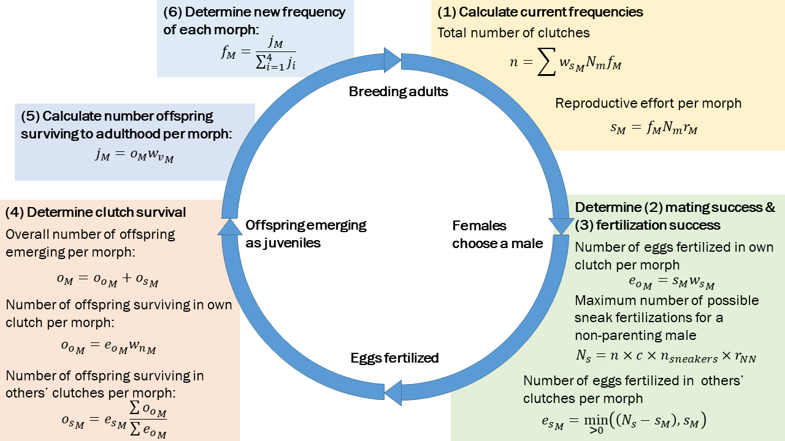

# README

This is a shiny app to show the frequency dependent expectations of our model of alternative reproductive tactics.

## The model

The model pertains to a population with four male reproductive morphs (courter-parents, courter-sneakers, noncourter-parents, and noncourter-sneakers). We are predicting which parameter combinations will allow multiple morphs to be maintained in the population. 

Here is the model:

It contains the following parameters:

**Adjustable:**

- initCP: Initial frequency of the courter-parent morph in the population. You can control this in the slider bar and see its effect when initNP==0 in the left-hand plot.
- initNP: Initial frequency of the noncourter-parent morph in the population. You can control this in the slider bar and see its effect when initCP==0 in the right-hand plot.
- initCN: Initial frequency of the courter-sneaker morph in the population. These values are plotted in the two graphs on the y-axis.
- initNN: Initial frequency of the noncourter-sneaker morph in the population. These values are plotted in the two graphs on the x-axis.
- c: Sperm competition coefficient. This value discounts the contribution of each sneaker but does not impact the nest-holding male's contribution. Larger values benefit sneakers, smaller values benefit nest-holders. You can adjust this in the slider bar.
- $r_M$: Relative reproductive effort/contribution for each morph ($M$). This sets a cap on the reproductive effort for each morph. Although there are four morphs, the reproductive effort is determined based on the courting trait. The slider bar (which you can adjust) determines the relative contribution of courters to non-courters; if r=0.5, courters have a reproductive effort (i.e., number of sperm) that is half that of non-courters ($r_{CP} = r_{CN} = 4$, $r_{NP} = r_{NN} = 8$) [these are the default values in the simulation model]. Values of r > 1 mean that courters have more reproductive investment than non-courters, and r < 1 means that non-courters invest more than courters.
- num sneakers: This value determines the number of sneakers that can fertilize each egg, in addition to the nesting male. If $num_{sneakers} = 3$, the total number of potential fathers is 4 males (the nest-holding male and 3 sneakers). You can adjust this with the slider bar.

**Not currently adjustable:**

- Nm: number of males in the population. Set to 500.
- Nf: number of females in the population. Set to 500, but not used in the calculations.
- ws: Sexual selection strength, aka female preference for male type. Set to 1 (unidirectional preference for courters).
- wn: Selection strength on nesting trait in males, aka nest survival. Set to 1 (parental male nests survive and non-parental nests all die).
- wv: Viability selection against courtship and nesting traits. Set to `exp(-1/(2*50))` (= 0.9900498).

The output is an estimate of the diversity (Shannon's diversity, estimated using `diversity` in the package `vegan`) of the morphs in the population after 1000 generations. These estimates are plotted as the values on the contour plots.

